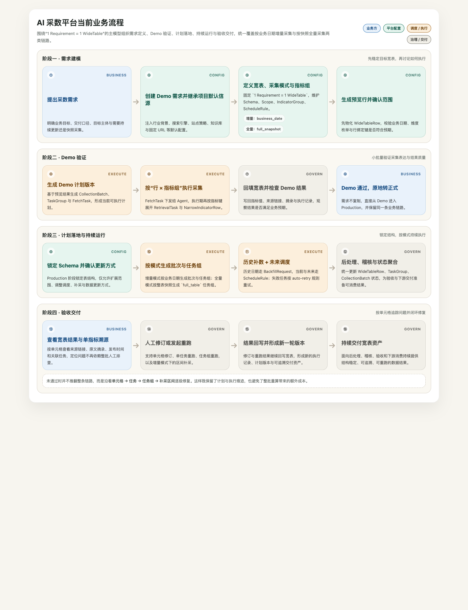
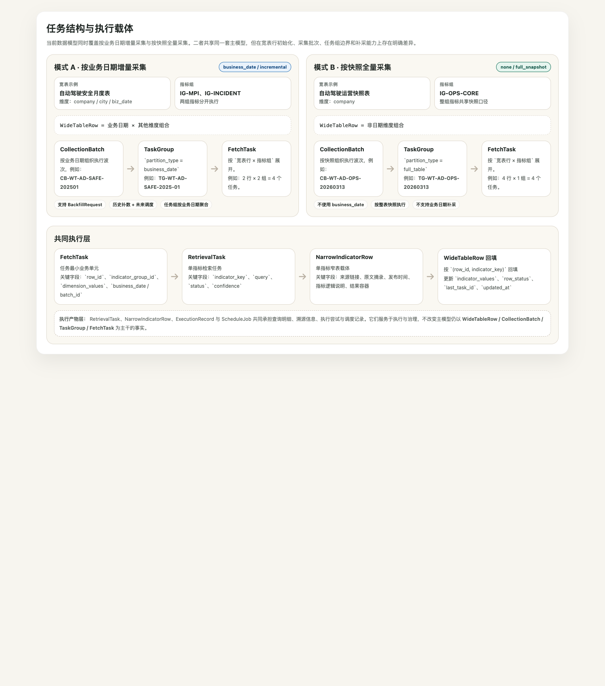

# AI 采数平台技术方案

## 一、业务背景与目标

### 1.1 背景

在 AI 投研及相关数据驱动场景中，业务侧持续提出从非结构化内容（网页、知识库、研报、监管公告、搜索结果）中提取结构化指标的需求。目前已基于 LLM + RAG + 搜索引擎验证了 AI 提取指标的技术可行性，但整体流程仍高度依赖人工，包括任务定义、维度拆分、数据格式转换、执行触发与结果回填等环节。

当前方式更接近“单个需求驱动的一次性脚本执行”：IT 手动建表、手动梳理维度枚举并组合、拼装 Prompt、跑脚本启动 Agent、将 Agent 执行结果转换为 CSV、人工校对后再入库。每个新需求都是从零开始，做完即止，没有统一的计划物化方式，也没有稳定的增量调度或快照执行机制。随着需求数量增加，人工就会成为整个链路的瓶颈。

因此，要解决的核心问题不再是“AI 能否提数”，而是如何把一次性验证能力升级为**可规模化、可自动化、可持续生产**的工程能力。

### 1.2 目标

本平台的目标是打造一个支持规模化、自动化和可溯源的 AI 数据抽取系统，核心目标包括：

- **配置一次，持续生产数据**：业务方提出需求后，IT 完成一次结构化配置，后续历史回填、周期执行、失败重试与补采尽可能由平台自动完成。
- **先低成本验证，再规模化放大**：正式运行前先跑小批量 Demo，以最低成本验证采集质量和需求方向；通过后再锁定结构并扩展范围。
- **统一支撑两类采集模式**：既支持按业务日期持续增量采集，也支持按快照全量采集，避免两类需求分别造模。
- **每个数据点都可追溯**：每个指标值都应能追溯来源链接与原文摘录；出现问题时可以定位到单指标或单任务进行重采，而不是整批推倒重来。

---

## 二、整体方案

平台以“目标宽表”作为指标数据需求的锚点：在需求中定义宽表结构、范围、指标分组和调度规则，系统再依据规则初始化宽表行、生成采集批次、任务组与采集任务，并将 Agent 返回的结果回填到宽表。

整体分为四个阶段：

**需求建模 → Demo 验证 → 计划落地 → 持续运行与验收**



从系统实现上看，当前链路由三部分组成：

- **前端**：负责项目、需求、定义、执行、数据产出、验收、调度与运维页面
- **后端**：负责数据持久化、计划生成、调度编排、执行回填与管理接口
- **Agent 服务**：负责执行单个采集任务并返回指标结果与检索明细

整体设计遵循如下关键原则：

1. **宽表是最终交付目标。** 当前正式口径下，`1 个 Requirement = 1 张 WideTable`，需求、计划和执行都围绕同一张宽表展开。
2. **Demo 与 Production 分阶段控制。** Demo 阶段允许反复调整结构和范围；Production 阶段锁定 Schema，仅允许扩展范围、调整调度与补采。
3. **任务拆分以“行 × 指标组”为粒度。** 兼顾上下文完整性与并发度，避免一次让 Agent 采集过多指标而导致质量下降。
4. **“窄表”是执行载体而不是规划对象。** 它用于记录单指标粒度的检索结果、来源和摘录，但不作为顶层主模型存在。
5. **统一支持两种采集模式。** 在同一套模型下同时表达：
   - 按业务日期增量采集
   - 按快照全量采集

---

## 三、核心数据模型与约束

### 3.1 项目

项目（Project）是顶层业务容器，用于组织同一行业或专题下的多条需求，并承载跨需求复用的默认配置，例如行业背景、业务背景、搜索引擎和知识库配置等。

### 3.2 需求

需求（Requirement）是平台的核心聚合根，负责承载业务目标、业务边界、交付范围以及采集策略。当前正式模型下：

- 1 个 Requirement 对应 1 张 WideTable；
- Requirement 分为 **Demo 阶段** 与 **Production 阶段**；
- Demo 转正式采用**原地转换**，不额外派生新的正式需求记录。

两个阶段的约束如下：

| 阶段 | 说明 |
| --- | --- |
| **Demo 阶段** | 表结构未锁定，允许修改 Schema、调整维度范围、重组指标组。用于快速验证采集质量和需求方向。 |
| **Production 阶段** | 表结构锁定，禁止修改 Schema，只允许扩展范围、调整调度、补采与更新方式，保证长期结构一致性。 |

需求还包含**采集策略**（Collection Policy），用于定义信源，包括：搜索引擎、站点策略、知识库、固定 URL、空值策略、来源优先级和值格式要求。

### 3.3 宽表

宽表（WideTable）是业务定义与执行计划的边界。任务生成、数据回填、调度和补采都以宽表为边界展开。每张宽表包含以下组成部分：

#### 结构约束元数据

宽表结构由 `WideTableSchema` 描述，列分为四类：

- **主键列**：整数型主键，唯一标识每一行。
- **维度列**：承载主体、地区、时间等维度信息。
- **指标列**：每个指标列必须声明单位、口径等描述性信息。
- **系统列**：记录行状态、最近任务、更新时间等系统字段。需要注意的是，溯源信息是单指标粒度，不存在宽表行级别的完整溯源字段。

#### 指标组集合

指标列会被分配到不同的指标组中。指标组决定任务如何拆分。当前约束为：

- 组间指标键不允许重叠；
- 所有指标组必须覆盖全部指标列；
- 每组可附带默认 Agent、Prompt 模板、Prompt 配置、优先级、超时、信源偏好等执行参数。

#### 范围

范围（Scope）负责将自然语言范围收敛为可枚举、可初始化的记录集合，包含：

- **业务日期范围**：仅在按业务日期增量模式下存在，支持按月和按年，年频数据支持“最新年度按季度展开”。
- **维度枚举范围**：每个非日期维度列必须给出枚举值列表，系统据此做笛卡尔积以初始化宽表行。

#### 调度规则

- **调度规则（ScheduleRule）**：定义当期与未来数据如何自动触发执行，包括频率、触发时间、自动重试限制、是否启用等。
- **补采请求（BackfillRequest）**：定义历史范围补采或重跑，包括开始/结束业务日期、来源、状态、原因等。

### 3.4 两种采集模式

这是当前模型相对旧方案最大的变化。宽表不再强制要求业务日期维度，而是通过两组字段来表达数据采集语义：

- `semantic_time_axis`
- `collection_coverage_mode`

当前支持两种正式模式：

#### 模式 A：按业务日期增量采集

对应组合为：

```text
semantic_time_axis = business_date
collection_coverage_mode = incremental_by_business_date
```

其约束为：

- 必须存在且仅存在 1 个业务日期维度；
- `scope.business_date` 必须存在，并指向该业务日期维度；
- 宽表行按 `(业务日期 × 其他维度组合)` 初始化；
- 任务组通常按业务日期拆分；
- 支持按业务日期范围发起补采请求。

#### 模式 B：按快照全量采集

对应组合为：

```text
semantic_time_axis = none
collection_coverage_mode = full_snapshot
```

其约束为：

- 不允许存在业务日期维度；
- `scope.business_date` 必须为空；
- 宽表行仅按非日期维度组合初始化；
- 采集批次与任务组按整表快照组织；
- 不支持按业务日期范围补采。

这意味着，平台当前已经在同一套模型下同时覆盖“增量模式”和“全量模式”，无需为两类需求分别设计不同的数据结构。

### 3.5 宽表行、采集批次、任务组与采集任务

#### 宽表行（WideTableRow）

系统根据宽表范围初始化宽表行。每条宽表行至少包含：

- 行主键 `row_id`
- 维度值 `dimension_values`
- 业务日期 `business_date`
- 行绑定键 `row_binding_key`
- 指标值集合 `indicator_values`
- 系统值集合 `system_values`
- 计划版本 `plan_version`

其中，`row_binding_key` 由业务日期与维度值拼装而成，用于稳定识别同一条业务实体行。

#### 采集批次（CollectionBatch）

采集批次表示“本轮采集覆盖范围”。它的作用是把“宽表行初始化”与“任务组生成”之间再细化出一层批次语义：

- 在增量模式下，批次承载某一波业务日期执行信息；
- 在全量模式下，批次承载某次整表快照的执行信息。

#### 任务组（TaskGroup）

任务组是调度单元。它不再只等于“某张宽表某个业务日期”，而是由分区方式决定边界。当前主流程实际使用两类分区：

- `business_date`
- `full_table`

因此：

- 增量模式下，任务组通常表示某张宽表在某个业务日期下的一批任务；
- 全量模式下，任务组通常表示某张宽表在某个快照批次下的一批整表任务。

#### 采集任务（FetchTask）

采集任务是执行单元，拆分公式为：

```text
FetchTask = 宽表行（WideTableRow） × 指标组（IndicatorGroup）
```

也就是说，同一张宽表下先确定行集合，再按指标组展开为一批可并发执行的采集任务。

### 3.6 窄表作为记录 Agent 响应内容的载体

单指标窄表行的展开规则为：

```text
单指标窄表行 = 采集任务 × 指标键
```

每条窄表行携带维度信息、指标定义与结果容器，用于记录单指标粒度的执行结果。当前执行产物层主要包括：

- **RetrievalTask**：单指标检索任务，记录 query、状态、置信度等；
- **NarrowIndicatorRow**：单指标窄表载体，记录来源站点、来源链接、原文摘录、发布时间、指标逻辑说明等；
- **ExecutionRecord**：记录单次 FetchTask 执行尝试；
- **ScheduleJob**：记录一次调度层面的触发。

因此，窄表仍然存在，但属于执行产物层，而不是新的主流程规划实体。

---

## 四、任务拆分与执行逻辑

当前执行链路不再是“直接建任务再执行”，而是先完成定义与预览，再正式落地计划。核心链路可以概括为：

**定义与预览 → 计划持久化 → 调度执行 → 结果回填**



### 4.1 定义与预览

需求定义首先发生在 Demo 阶段。当前步骤为：

1. 创建 Demo 需求；
2. 维护需求基本信息、采集策略、宽表结构、范围与指标组；
3. 生成并持久化预览宽表行；
4. 由业务侧确认当前预览结果是否符合预期。

这一步的目标不是立即执行，而是先把“宽表长什么样、范围有多大、指标怎么分组”稳定下来。

### 4.2 Demo 转正式与计划落地

当 Demo 需求验证通过后，系统通过原地转换将其切换到 Production 阶段。转换后：

- `phase` 从 `demo` 进入 `production`
- `schema_locked` 从未锁定变为锁定
- 需求状态进入正式规划阶段

在正式定义确认后，系统落地完整计划，主要完成以下动作：

1. 保存最新的宽表结构、范围与指标组；
2. 保存宽表行；
3. 生成采集批次、任务组与采集任务；
4. 替换旧版本计划；
5. 对正式需求推进执行状态。

### 4.3 增量模式下的任务拆分

在“按业务日期增量采集”模式下，系统按照如下顺序展开：

1. 展开业务日期范围；
2. 对其他维度列取笛卡尔积；
3. 生成 `(业务日期, 维度组合)` 粒度的宽表行；
4. 按业务日期生成任务组；
5. 在任务组内按 `宽表行 × 指标组` 生成采集任务。

在正式运行时：

- 历史业务日期优先走补采链路；
- 当前与未来业务日期由调度规则在触发时间后自动创建或执行。

### 4.4 全量模式下的任务拆分

在“按快照全量采集”模式下，系统不再按业务日期拆分，而是按整表快照组织：

1. 仅按非日期维度枚举生成宽表行；
2. 为每次快照生成采集批次；
3. 基于该批次生成 `full_table` 类型的任务组；
4. 对全表行集合按 `宽表行 × 指标组` 生成采集任务。

此时，时间锚点来自快照批次的 `snapshot_label` 与 `snapshot_at`，而不是宽表行中的业务日期。

### 4.5 Agent 执行与回填

采集任务由调度器统一编排，并通过独立 Agent 服务执行。执行过程包括：

1. 调度器触发任务组或采集任务；
2. 为当前指标组生成结构化 Prompt；
3. 构造包含需求、宽表、批次、任务、行和信源信息的执行请求；
4. 调用 Agent；
5. 保存指标结果、检索任务与执行记录；
6. 按 `(row_id, indicator_key)` 回填宽表；
7. 重新聚合任务组与批次状态。

当前 Prompt 已按指标组拆分生成，并包含：

- 核心查询需求
- 业务知识
- 指标列表
- 维度列信息
- 输出限制

### 4.6 重试、重采、补采与失效

系统区分四类重新执行动作：

| 类型 | 说明 |
| --- | --- |
| **自动重试** | 同一采集任务执行失败后的自动重试，受自动重试次数限制控制。 |
| **手动重跑** | 支持按任务组或单任务粒度重新执行。 |
| **重采** | 证据不足或验收不通过时，对单元格、行或指标组发起采集。 |
| **补采** | 对历史业务日期范围的补齐或历史重跑，仅适用于增量模式。 |

当 Demo 阶段发生表结构变更、范围变化或指标组调整时，已生成任务计划会失效，需要基于新版本重新生成。这一层当前通过 `plan_version` 承载计划版本语义。

---

## 五、稽核与验收

采数结果回填到宽表后，仍需通过后处理、稽核与人工验收，最终形成可交付结果。

### 5.1 后处理

当前后处理主要负责对“可入库但不够标准”的结果进行修正，典型包括：

- 数字与日期格式修复；
- 空值归一化；
- 百分比与单位转换；
- 基于语义结果的指标填充。

### 5.2 稽核

当前稽核规则主要围绕以下几类问题：

- 类型与范围是否合理；
- 关键字段是否为空；
- 来源是否缺失；
- 指标口径或趋势是否存在明显冲突。

### 5.3 验收

为了帮助用户验收数据，系统支持：

- 单指标级溯源展开（来源链接、原文摘录、发布时间等）；
- 直接定位单元格对应的任务和任务组；
- 人工修订宽表单元格；
- 一键触发重跑或失败重试（单任务、任务组等粒度）。

当前验收阶段已经具备“查看结果 → 修订结果 → 重新执行”的基本闭环。

---

## 六、当前实现边界

当前平台已经具备“需求定义 → 计划落地 → 调度执行 → 结果回填 → 验收修订”的主链路，但仍需明确以下边界：

1. **Agent 仍为 mock 服务。**
   - 当前远程执行协议已经打通，但真实搜索、RAG 与网页抽取能力尚未在仓内实现。
2. **证据模型仍偏轻量。**
   - 宽表单元格主要保存值、值说明、最大最小值、数据源和来源链接；
   - 更完整的摘录、发布时间、来源站点等信息主要保存在检索任务与窄表结果层。
3. **稽核与发布门禁尚未完全闭合。**
   - 当前已具备后处理、轻量稽核与验收修订能力；
   - 但还未形成严格的“审核通过后发布入库”生产主流程。
