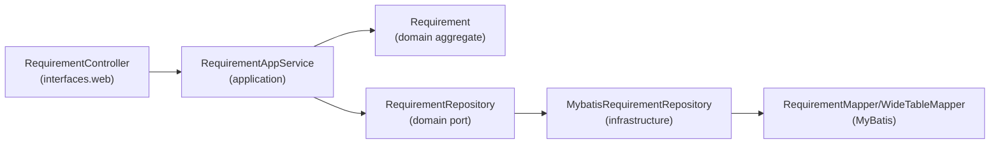

# DDD 分层重构方案（以 Requirement 为例）

> 适用范围：`data-foundry-backend-service`（同样可迁移到 `data-foundry-scheduler-service` / `data-foundry-agent-service`）

## 1. 当前结构概览与主要问题

以 `data-foundry-backend-service` 为例，当前主要按技术分层组织：

- `...backend/web`：Controller
- `...backend/service`：Service（混合业务规则、编排、持久化调用）
- `...backend/persistence`：MyBatis `Mapper` + `Record`
- `...backend/config`：配置

在 Requirement 链路上，典型问题包括：

- Controller 直接依赖 `*Mapper`，导致表现层与持久化强耦合。
- Controller 同时承担事务、用例编排、业务规则（如 `schemaLocked` 规则）、DTO/JSON 组装。
- “提交后生成任务计划”等跨子域动作由 Controller 触发，难以演进与复用。

## 2. DDD 分层方案（推荐：分层 + 端口适配）

目标依赖方向：

`interfaces(web) -> application -> domain <- infrastructure`

### 2.1 各层职责边界（必须遵守）

#### A) `interfaces.web`（表现层 / 入站适配器）

**做什么**
- 定义 HTTP API（Controller、路由、状态码）
- 基础输入校验（必填/格式/长度）
- 将 Request DTO 转为应用层 Command / Query
- 将应用层 DTO 转为 Response DTO
- 异常映射（Domain/Application 异常 -> HTTP）

**不做什么**
- 禁止直接注入/调用 `*Mapper`、SQL
- 禁止编写业务规则（如“ready 时锁 schema”、“锁后禁改 definition”）
- 禁止承担事务边界（事务放在应用层）
- 禁止跨子域编排（例如直接调用 TaskPlan 生成）

#### B) `application`（应用层 / Use Case 编排）

**做什么**
- 用例编排（完成一次用户意图的步骤组织）
- 事务边界（`@Transactional`）
- 调用领域模型执行业务规则
- 调用领域端口（Repository/Gateway）进行持久化与外部访问
- 组装并返回应用层 DTO

**不做什么**
- 不依赖 MyBatis/Mapper/Record
- 不处理 HTTP 细节（不抛 `ResponseStatusException`）
- 规则尽量不写成散落的 if/else（应下沉到 Domain）

#### C) `domain`（领域层 / 业务核心）

**做什么**
- 聚合/实体/值对象建模（表达业务语言）
- 领域不变量与业务规则（如 `schemaLocked` 约束、状态流转）
- 领域服务（仅用于“无法自然归属到某个聚合”的业务规则/算法）
- 定义端口接口（如 `RequirementRepository`）
- 领域事件（可选但推荐，用于解耦跨子域动作）

**不做什么**
- 不依赖 Spring MVC、MyBatis 等基础设施实现
- 不做用例编排（那是 Application 的职责）

#### D) `infrastructure`（基础设施层 / 出站适配器）

**做什么**
- 实现 Domain 定义的端口（Repository/Gateway 实现）
- MyBatis Mapper/Record/SQL
- Domain <-> Record 的映射（含 JSON 字段如何存取）
- 外部系统 client、配置等

**不做什么**
- 不承载业务规则（规则属于 Domain）
- 不让上层直接依赖 Mapper/Record（通过端口隔离）

## 3. 领域层与 Service 是否合并（结论与约定）

### 3.1 结论

**不建议把“领域层”与当前笼统的 `service` 层合并。**

建议取消“语义不清的 service 层”，改为明确区分：

- **Application Service（应用服务）**：以用例为中心（编排、事务、调用端口与领域）
- **Domain Service（领域服务）**：以领域规则为中心（算法/规则），尽量纯 Java

### 3.2 命名约束

- 应用层：`*AppService` / `*ApplicationService`
- 领域层：`*DomainService`
- 不再出现无语义的裸 `*Service`（除非所在层与职责非常明确且团队约定允许）

## 4. 包命名规范（按“子域/上下文 + 分层”）

根包保持现有风格（示例以 backend 为主）：

`com.huatai.datafoundry.backend.<context>.<layer>...`

其中 `<context>` 为子域/限界上下文，例如：`requirement`、`project`、`task`。

### 4.1 Interfaces（入站）

- `com.huatai.datafoundry.backend.<context>.interfaces.web`
  - `XxxController`
- `com.huatai.datafoundry.backend.<context>.interfaces.web.dto`
  - `XxxCreateRequest` / `XxxUpdateRequest` / `XxxResponse`
- `com.huatai.datafoundry.backend.<context>.interfaces.web.assembler`
  - `XxxDtoAssembler`

约束：
- Controller **只**依赖 `application`
- Controller **禁止**依赖 `Mapper/Record`

### 4.2 Application（用例）

- `com.huatai.datafoundry.backend.<context>.application`
  - `service`：`XxxAppService`
  - `command`：`CreateXxxCommand` / `UpdateXxxCommand`
  - `query`：`GetXxxQuery` / `ListXxxQuery`
  - `dto`：`XxxDTO`
  - `handler`（可选）：事件/消息处理器

### 4.3 Domain（核心）

- `com.huatai.datafoundry.backend.<context>.domain`
  - `model`：聚合/实体/值对象
  - `service`：`*DomainService`
  - `repository`：端口接口（`XxxRepository`）
  - `event`：领域事件
  - `exception`：领域异常

### 4.4 Infrastructure（实现）

- `com.huatai.datafoundry.backend.<context>.infrastructure`
  - `persistence.mybatis.mapper`：`XxxMapper`
  - `persistence.mybatis.record`：`XxxRecord`
  - `repository`：`XxxRepositoryImpl`（实现 domain 端口）
  - `client`：外部调用
  - `config`：基础配置

## 5. Requirement 示例：从当前实现到 DDD 分层

### 5.1 当前“创建需求”用例做了什么（含 wideTable）

当前 `RequirementController.create()` 的语义是：

1. 插入 `requirements` 表（创建 Requirement）
2. **同一个事务中**插入 `wide_tables` 表（创建 primary wideTable 的“宽表定义”记录）
3. 查询并返回 “Requirement + primary wideTable” 的组合响应

> 这里的 **wideTable** 是“宽表定义/指标与口径配置”数据记录，并非立即创建物理数据表。

### 5.2 建议的领域建模（简化版，可渐进）

**限界上下文**：`requirement`

**聚合建议**：
- 聚合根：`Requirement`
- 聚合内实体（或定义对象）：`WideTable`（primary wideTable）

**核心规则**（逐步下沉到 Domain）：
- `schemaLocked=true` 时禁止 definition edits
- 状态流转：`draft/aligning -> ready` 时锁定 schema
- 领域事件（可选）：`RequirementSubmitted`（用于触发任务计划生成等跨子域动作）

### 5.3 目标包与类落点（示例清单）

#### Interfaces 层

- `com.huatai.datafoundry.backend.requirement.interfaces.web.RequirementController`
- `com.huatai.datafoundry.backend.requirement.interfaces.web.dto.RequirementCreateRequest`
- `com.huatai.datafoundry.backend.requirement.interfaces.web.dto.RequirementUpdateRequest`
- `com.huatai.datafoundry.backend.requirement.interfaces.web.dto.RequirementResponse`
- `com.huatai.datafoundry.backend.requirement.interfaces.web.dto.RequirementWithWideTableResponse`
- `com.huatai.datafoundry.backend.requirement.interfaces.web.assembler.RequirementDtoAssembler`

#### Application 层

- `com.huatai.datafoundry.backend.requirement.application.service.RequirementAppService`
  - `create(projectId, CreateRequirementCommand)`
  - `update(projectId, requirementId, UpdateRequirementCommand)`
  - `submit(projectId, requirementId, SubmitRequirementCommand)`（可选：把 “ready” 单独作为提交用例）
- `com.huatai.datafoundry.backend.requirement.application.command.CreateRequirementCommand`
- `com.huatai.datafoundry.backend.requirement.application.command.UpdateRequirementCommand`
- `com.huatai.datafoundry.backend.requirement.application.dto.RequirementDTO`
- `com.huatai.datafoundry.backend.requirement.application.dto.WideTableDTO`

> 事务边界建议放在 `RequirementAppService` 对应方法上。

#### Domain 层

- `com.huatai.datafoundry.backend.requirement.domain.model.Requirement`
- `com.huatai.datafoundry.backend.requirement.domain.model.WideTable`
- `com.huatai.datafoundry.backend.requirement.domain.model.RequirementStatus`（值对象/枚举）
- `com.huatai.datafoundry.backend.requirement.domain.repository.RequirementRepository`
- `com.huatai.datafoundry.backend.requirement.domain.exception.RequirementLockedException`
- `com.huatai.datafoundry.backend.requirement.domain.event.RequirementSubmitted`（可选）

#### Infrastructure 层

- `com.huatai.datafoundry.backend.requirement.infrastructure.repository.MybatisRequirementRepository`
- `com.huatai.datafoundry.backend.requirement.infrastructure.persistence.mybatis.mapper.RequirementMapper`
- `com.huatai.datafoundry.backend.requirement.infrastructure.persistence.mybatis.record.RequirementRecord`
- `com.huatai.datafoundry.backend.requirement.infrastructure.persistence.mybatis.mapper.WideTableMapper`
- `com.huatai.datafoundry.backend.requirement.infrastructure.persistence.mybatis.record.WideTableRecord`

### 5.4 用例调用链路（示意）

### 5.5 “提交后生成任务计划”应放在哪里

现状是 Controller 直接调用 `TaskPlanService.ensureDefaultTaskGroupsOnSubmit(requirementId)`。

建议迁移为以下二选一：

1) **应用层直接编排**：`RequirementAppService.submit(...)` 内在事务提交后调用 task 子域的应用服务。
2) **领域事件驱动**：Domain 发出 `RequirementSubmitted`，Application 层 handler 订阅并调用 task 子域用例（更解耦，推荐长期演进）。

无论哪种，**都不应由 Controller 直接调用**。

## 6. 渐进式落地步骤（建议）

1. 先新增 `RequirementAppService` + Command/DTO，把 Controller 变薄（接口不变、功能不变）。
2. 抽 `RequirementRepository` 端口 + MyBatis 实现，Application 不再依赖 `Mapper`。
3. 下沉领域规则到 `Requirement` 聚合（schema lock、状态流转、definition edits 约束）。
4. 再考虑引入领域事件/集成事件，解耦 task 计划生成等跨子域动作。

