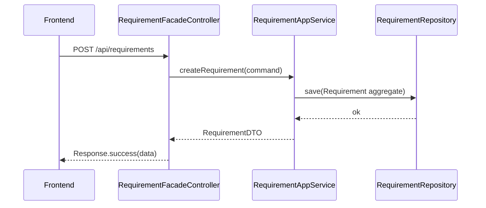
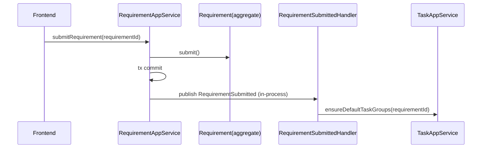
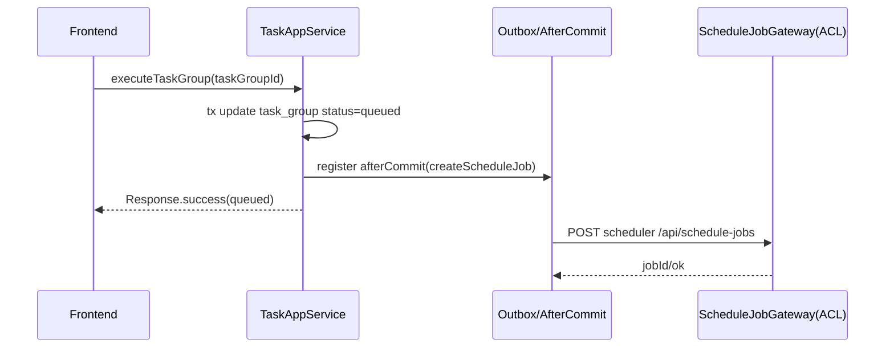

# datafoundry_java 全项目 DDD 分层重构方案（评审补齐版）

> 本文在 `docs/DDD-重构方案-按包命名规范-全项目.md` 的基础上，结合评审意见补齐“聚合清单、规则归属、事务边界、读写分离、统一响应错误语义、ACL、防腐层、DB 迁移、事件机制、对象转换、测试、安全、性能批处理、迁移映射、时序图、样板代码”等关键内容。
>
> 包命名规范（以图片为准）：统一采用  
> `com.huatai.datafoundry.<service>.<context>.<layer>...`  
> - `<service>`：`backend` / `scheduler` / `agent`  
> - `<context>`：`requirement`、`project`、`task`、`schedule`、`ops`（必要时可新增 `integration`）  
> - `<layer>`：`interfaces` / `application` / `domain` / `infrastructure`

---

## 1. 分层职责与硬约束（落地不可违背）

依赖方向：

`interfaces -> application -> domain <- infrastructure`

硬约束（代码评审 checklist）：
- Controller（`interfaces`）只能依赖 `application`，**禁止**注入 MyBatis `Mapper/Record`。
- Application 只能依赖 `domain`（以及 domain 端口），**禁止**直接依赖 `Mapper/SQL/contract DTO`。
- `Mapper/Record/XML/HTTP client` 只允许出现在 `infrastructure`。
- 禁止用 `@Lazy`、字段注入等规避分层/循环依赖；循环依赖用“抽端口 + 拆分职责”解决。

---

## 2. Bounded Context 与“聚合设计清单”（必须补齐）

> 上下文（context）≠ 聚合（aggregate）。聚合清单决定“领域边界、事务边界、建模粒度、性能与一致性策略”。  
> 下表为 **建议的目标态**，可按业务演进微调，但必须形成团队共识并固化为文档/评审规则。

### 2.1 聚合设计表（建议）

| Context | Aggregate Root | 包含实体/值对象（示例） | 通过聚合根暴露的行为（示例） | 与其他聚合交互方式 | 是否允许跨聚合同事务更新 |
|---|---|---|---|---|---|
| backend.project | `Project` | `DataSourcePolicy`(VO) | `updateProfile()`、`updateDataSourcePolicy()` | 其它聚合仅持有 `projectId` 引用 | 否（仅本聚合） |
| backend.requirement | `Requirement` | `WideTableDefinition`(Entity/VO)、`CollectionPolicy`(VO)、`RequirementStatus`(VO) | `updateDefinition()`、`submit()`、`lockSchema()` | 引用 `projectId`；提交后通过事件/用例触发 task 侧动作 | 否（跨聚合动作用事件/用例编排） |
| backend.task | `TaskGroup` | `TaskGroupStatus`(VO)、统计计数(VO) | `ensurePlanned()`、`markRunning()`、`markCompleted()`、`markFailed()` | 引用 `requirementId`、`wideTableId`；fetch 任务作为独立聚合（见下一行） | 同一 context 内可在 **同一事务**更新 TaskGroup + FetchTask（通过仓储批处理），但不跨 context |
| backend.task | `FetchTask` | `FetchTaskStatus`(VO)、`RowBindingKey`(VO) | `start()`、`complete()`、`retry()` | 引用 `taskGroupId`；状态变化通过应用层回写 TaskGroup 汇总 | 同上（同 context 内允许） |
| backend.task | `Execution`（可选/目标态） | `ExecutionAttempt`(Entity)、`ExecutionStatus`(VO) | `startAttempt()`、`finishAttempt()` | 引用 `taskGroupId`/`taskId`；对接 scheduler/agent 的执行流水 | 同 context 内允许；跨服务用 outbox/event |
| scheduler.schedule | `ScheduleJob` | `TriggerType`(VO)、`JobStatus`(VO) | `create()`、`complete()`、`fail()`、`cancel()` | 引用 `taskGroupId`/`taskId`；对 agent 触发用网关 | 否（跨服务用事件/补偿） |
| agent.agent | `AgentExecution`（可选/目标态） | `ExecutionRequest`(VO)、`ExecutionResult`(VO) | `execute()`（封装执行器策略） | 由 scheduler/backend 通过 ACL 调用 | 否（agent 为边界） |
| backend.schedule | **无领域聚合（BFF/ACL）** | 仅 DTO/ReadModel | 聚合查询/转发（不承载业务规则） | 通过 `ScheduleJobGateway` 调 scheduler | 不适用 |
| backend.ops / scheduler.ops | **弱领域或无聚合** | 规则/字典/统计 ReadModel | 仅查询/管理（需权限） | 不与核心聚合共享事务 | 不适用 |

#### 关键判断说明（对应评审问题）

- `Requirement` 是聚合根：原因是 `schemaLocked`、状态流转、提交语义等规则围绕 Requirement 收敛；并且创建时需要强一致创建 primary `WideTableDefinition`。
- `WideTableDefinition` 在 Requirement 聚合内：原因是创建/更新 wide table 定义受 `schemaLocked` 约束，且与 requirement 提交/计划落地强关联。
- `TaskGroup` 与 `FetchTask` 不强制同一聚合根：原因是 `FetchTask` 数量可能较多，若强行作为 TaskGroup 聚合内实体，会导致“聚合过大、加载笨重”。推荐“同 context 内两个聚合 + 事务内批处理更新”。
- `Execution` 是否独立聚合：推荐作为目标态，为“执行历史/多次尝试/日志引用/外部 job 对齐”提供模型；在当前占位阶段可先不落表/聚合，但文档需预留归属。
- backend 的 `schedule` 不作为领域上下文：将其定位为 BFF/ACL（只做聚合视图/转发），避免出现“目录是 DDD、其实是跨域写主”的反模式。

---

## 3. 领域规则归属表（聚合方法 / 领域服务 / 应用编排）

> 目标：把当前散落在 Controller/Service 的规则，逐条映射到 **聚合行为**、**领域服务** 或 **应用服务用例**。  
> 这张表是防止“最终退化为事务脚本”的关键。

### 3.1 规则归属（建议）

| 规则/逻辑 | 归属层级 | 归属类（建议） | 说明 |
|---|---|---|---|
| Requirement 状态流转（draft/aligning → ready 等） | Domain（聚合） | `Requirement.submit()` / `Requirement.changeStatus()` | 状态机与不变量应在聚合内保证 |
| `schemaLocked` 后的编辑限制 | Domain（聚合） | `Requirement.updateDefinition()` / `Requirement.assertUnlocked()` | 任何更新 wide table/definition 的入口最终都要走聚合校验 |
| 创建 Requirement 时创建 primary WideTableDefinition | Application（编排） + Domain（工厂） | `RequirementAppService.createRequirement()` + `Requirement.create(...)` | 用例编排在 application；领域对象构造与合法性在 domain |
| Requirement 提交后默认 TaskGroup 生成 | Application（编排） + Domain（规则） | `RequirementAppService.submitRequirement()` +（可选）`TaskPlanDomainService` | “提交”是领域动作，但“生成任务实例”是跨聚合副作用，建议用事件/用例编排触发 |
| WideTable plan 落地规则（plan/preview、task_groups upsert） | Domain Service + Application | `TaskPlanDomainService.planFromWideTable()` + `RequirementAppService.persistPlan()` | 复杂的计划计算与验证放 domain service；持久化/事务在 application |
| TaskGroup / FetchTask 的创建与补齐（ensure-tasks） | Application + Domain Service | `TaskAppService.ensureTasks()` + `TaskPlanDomainService.ensureFetchTasks()` | 批量生成是算法 + 批处理落库；不应放 controller |
| Execute / Retry 的状态迁移（running/completed/pending） | Domain（聚合） + Application | `FetchTask.start/complete/retry()`、`TaskGroup.mark*()` + `TaskAppService.execute*()` | 状态迁移规则在 domain；外部调用/回写编排在 application |
| backend 与 scheduler/agent 协作触发策略（何时建 job、何时调 agent） | Application + Gateway（端口） | `TaskAppService.executeTaskGroup()` + `ScheduleJobGateway` / `AgentGateway` | 跨服务交互通过 domain 端口抽象，infrastructure 实现 ACL |

---

## 4. 应用服务事务边界设计（含跨服务时序与补偿）

> 原则：**一个用例（Use Case）≈ 一个 Application 方法 ≈ 一个本地事务边界**。  
> 跨服务不做分布式事务：采用“本地提交 + 事件/outbox + 重试/补偿”。

### 4.1 核心用例与事务边界（建议）

| 用例（Application 方法） | 本地事务包含哪些写操作 | 事务后动作（after commit） | 失败策略/补偿 |
|---|---|---|---|
| `ProjectAppService.create/update` | 写 `projects` | 无 | 本地回滚 |
| `RequirementAppService.createRequirement` | 写 `requirements` + 写 primary `wide_tables` | 无 | 本地回滚 |
| `RequirementAppService.updateRequirement` | 写 `requirements`（必要时 wide_tables） | 无 | 本地回滚 |
| `RequirementAppService.submitRequirement` | 写 `requirements(status, schemaLocked)` | 发布 `RequirementSubmitted` 事件（应用内同步）或写 outbox（跨服务） | 事件失败：重试/记录；状态不回滚（避免前端重复提交） |
| `RequirementAppService.persistPlan` | 写 `wide_tables`（若需）+ 批量 upsert `task_groups` | 可选：写 outbox 通知 scheduler（如需调度） | 批处理失败：回滚；幂等 upsert |
| `TaskAppService.ensureTasks(taskGroupId)` | 生成并批量 upsert `fetch_tasks` + 更新 `task_groups` totals | 无 | 幂等：已存在则跳过；失败回滚 |
| `TaskAppService.executeTaskGroup(taskGroupId)` | 更新 `task_groups` 状态（queued/running）+（可选）创建 `execution` 记录 | after commit 调 scheduler 创建 `ScheduleJob` | 外部调用失败：重试/补偿（通过 outbox） |
| `TaskAppService.executeTask(taskId)` | 更新 `fetch_tasks` 状态 + 更新 `task_groups` 统计 | after commit 调 agent 或由 scheduler 驱动 | 同上 |
| `ScheduleJobAppService.createJob`（scheduler） | 写 `schedule_jobs` | after commit 触发 agent（如同步/异步） | agent 失败：job 置 failed + 可重试 |

### 4.2 跨服务交互时序（建议）

#### 4.2.1 Create Requirement（本地事务）



#### 4.2.2 Submit Requirement → 触发 TaskPlan（应用内事件/同库）



> 如果后续需要跨服务（scheduler/agent）触发：把发布改为 outbox（见第 8 节事件机制）。

#### 4.2.3 Execute TaskGroup（本地提交 + after-commit 调 scheduler）



失败策略：
- scheduler 调用失败：记录 outbox 状态，后台重试；taskGroup 保持 queued，可由“重试调度”用例修复。

---

## 5. 读写分离策略（CQRS-lite）与查询模型设计

> 原则：**命令侧**以聚合为中心（Repository 端口）；**查询侧**允许 ReadModel/投影（避免“查询也还原聚合”导致笨重）。

### 5.1 命令侧（Command）

- `domain.repository.*Repository`：主要服务于命令侧，保证聚合一致性。
- `application.service.*AppService`：编排命令用例，事务边界在此。

### 5.2 查询侧（Query）

推荐在每个 context 的 application 下增加：
- `application.query/*QueryService`（或 `application.service` 内分方法，但建议显式 QueryService）
- `application.dto/*ReadDTO`（列表/统计/视图 DTO）

查询落地方式（按场景选用）：
1) 简单详情/需要领域规则：可从 Repository 加载聚合，再转 DTO。
2) 列表/分页/统计/ops/dashboard：走 **只读 QueryRepository/Mapper 投影**：
   - 定义 domain 端口：`*ReadRepository`（可选）或直接在 infrastructure 提供 `*QueryDao`（只读，禁止写）。
   - 返回 ReadDTO/Map 投影，避免 Record 泄漏到 controller。

约束：
- Query 层可依赖 infrastructure 的只读查询实现，但必须通过 application 暴露；controller 仍不得直连 mapper。
- ops/dashboard 类统计建议单独 read model（避免污染核心聚合）。

---

## 6. 统一接口响应与错误语义设计（必须固化）

### 6.1 统一返回结构

除 `/health`（以及少数下载/流式接口）外，统一返回：

```json
{ "code": 0, "message": "ok", "data": { } }
```

建议在 backend/scheduler/agent 各服务共享一套 `common-core`（可放在 backend shared 或新增 module），包含：
- `Response<T>`
- `ErrorCode`
- `BizException`（application 级）
- `DomainException`（domain 级，可选）
- `IntegrationException`（infrastructure/ACL 级）
- `GlobalExceptionHandler`

### 6.2 错误映射（建议）

| 异常类型 | 产生位置 | HTTP 状态码 | code 语义 |
|---|---|---|---|
| `DomainException` | domain | 409/400 | 业务规则冲突/不变量失败 |
| `BizException` | application | 400/409/404 | 用例级错误（资源不存在、非法操作） |
| `IntegrationException` | infrastructure ACL | 502/504 | 下游服务错误/超时 |
| 参数校验异常 | interfaces | 400 | 参数错误 |

约定：
- 前端展示 message：优先展示 `message`（必要时对外脱敏），detail 仅日志可见。
- legacy 与 canonical 接口 **必须共享同一 Response 与错误语义**，避免前端处理分裂。

---

## 7. 跨服务防腐层（ACL）设计细节

> 目标：避免在 AppService 里直接写 RestTemplate/Feign，打穿分层与领域边界。

### 7.1 端口 + ACL 适配的标准结构

以 backend 调 scheduler 为例：

- domain 定义端口（位于 backend 的 domain）：
  - `com.huatai.datafoundry.backend.task.domain.gateway.ScheduleJobGateway`
  - 方法：`createJob(ScheduleJobRequest)`、`getJob(jobId)`、`listJobs(filter)` 等
- infrastructure 实现 ACL（位于 backend 的 infrastructure）：
  - `com.huatai.datafoundry.backend.task.infrastructure.client.scheduler.SchedulerScheduleJobClient`
  - 负责：HTTP 调用、超时/重试、错误翻译、幂等键
- application 依赖端口，不依赖 contract DTO：
  - `TaskAppService` 只面对 domain DTO/VO，不直接使用 `com.huatai.datafoundry.contract.*`

### 7.2 contract 与输出对象的边界

建议约束：
- `common-contract` 仅用于 **infrastructure.client** 与对外 controller 的 DTO（若跨服务转发）。
- domain 模型不依赖 contract；若必须共享枚举/常量，复制为 domain VO 或通过适配层转换。

### 7.3 超时/重试/熔断与错误翻译

归属：
- 超时、重试、熔断：`infrastructure.client` 负责（例如 1s/3s 超时，指数退避重试 3 次）。
- 错误翻译：把下游错误映射为 `IntegrationException(ErrorCode.DOWNSTREAM_*)`，由全局异常处理器统一返回。

### 7.4 幂等与写主（避免双写）

- 写主（Source of Truth）：
  - `schedule_jobs`：scheduler-service 写主；backend 只能通过 gateway 触发创建/查询。
- 幂等：
  - create schedule job 建议携带幂等键（例如 `taskGroupId + triggerType + requestId`），scheduler 侧唯一约束或 upsert。

---

## 8. 数据库迁移与版本化演进方案（必须落地）

### 8.1 Flyway/Liquibase 选择

推荐 Flyway（每个服务各自维护 migration）：
- backend：`data_foundry_backend`
- scheduler：`data_foundry_scheduler`
- agent：如后续引入库再单独维护

若审批限制：提供替代方案（手工版本脚本 + 发布 SOP），但仍需：
- 脚本编号/顺序/回滚策略
- dev/test/prod 一致性校验

### 8.2 表 ownership（按 context 归属，避免“多处写同表”）

建议在文档中固化“表归属表”，至少覆盖已用表：

| DB | 表 | owner context | 允许写入的服务 | 说明 |
|---|---|---|---|---|
| backend | `projects` | backend.project | backend | 仅 project 用例写 |
| backend | `requirements` | backend.requirement | backend | 提交/锁定在此表 |
| backend | `wide_tables` | backend.requirement | backend | 宽表定义与计划配置 |
| backend | `task_groups` | backend.task | backend | 任务实例组 |
| backend | `fetch_tasks` | backend.task | backend | 子任务实例 |
| scheduler | `schedule_jobs` | scheduler.schedule | scheduler | job 写主 |

### 8.3 现有 schema 的升级路径

文档需明确：
- 现有最小可用表（已被代码依赖）与目标 full schema 的差异
- 每次迭代的迁移脚本（新增字段/索引/约束）与回滚策略
- demo 数据（seed/reset）迁移到“可重放的 migration 或专用 seed 脚本”

---

## 9. 事件机制设计（同步域事件 + 可扩展异步）

> 目标：避免把“状态变化触发后续动作”全部塞进一个巨大 AppService 事务脚本。

### 9.1 事件类型

- **领域事件（Domain Event）**：同进程内，用于解耦 domain 状态变化与后续动作（同步处理即可）。
  - 例：`RequirementSubmitted`
- **集成事件（Integration Event）**：跨服务（scheduler/agent），建议用 outbox 模式可靠投递。
  - 例：`TaskGroupQueued`、`ScheduleJobCreated`

### 9.2 发布点与处理器归属

- 发布点：domain 聚合方法内记录事件（例如 `Requirement.submit()` 产生事件）。
- 分发与处理：application 层 handler（例如 `RequirementSubmittedHandler`）订阅并编排后续用例（如生成 task groups）。
- 若跨服务：application 在本地事务内写 outbox（表 `outbox_events`），由 infrastructure publisher 异步投递 HTTP/消息。

### 9.3 失败处理

- 同步域事件失败：记录日志 + 转为 BizException（若必须强一致），或降级为“稍后重试任务”（推荐把副作用做成可重试）。
- outbox 投递失败：状态保持 pending，后台重试；确保幂等。

---

## 10. 统一对象转换策略（必须约束）

| 转换 | 负责层 | 负责包/类（建议） |
|---|---|---|
| Request DTO → Command/Query | interfaces | `interfaces.web.assembler/*` |
| Application DTO → Response DTO | interfaces（或 application） | 优先 interfaces assembler，保证 controller 纯适配 |
| Domain ↔ Record/DO | infrastructure | `infrastructure.repository/*RepositoryImpl` 内部 |
| contract DTO ↔ domain DTO | infrastructure（ACL） | `infrastructure.client/*` |
| Query 投影 → ReadDTO | application（QueryService） | `application.query/*` |

规则：
- 禁止 controller 手工拼 domain 对象。
- 禁止 query 接口直接返回 Record（避免“快但脏”的泄漏）。
- 自动映射（BeanCopier/MapStruct）允许用于“结构相似且无业务语义”的 DTO；带规则的转换必须手工。

---

## 11. 测试策略设计（分层最小覆盖）

### 11.1 分层测试建议

| 层 | 测试类型 | 工具建议 | 目标 |
|---|---|---|---|
| domain | 单元测试 | JUnit | 覆盖状态机、不变量、关键规则 |
| application | 用例测试（含事务） | SpringBootTest + H2/容器化 DB（视约束） | 覆盖用例编排、事件触发、幂等 |
| infrastructure | Repository/Mapper 集成测试 | Testcontainers MySQL（优先） | 覆盖 XML 映射、批量 upsert、锁语义 |
| interfaces | WebMvc 测试 | MockMvc | 覆盖路由、校验、统一 Response、legacy 兼容 |
| contract | 契约测试（可选） | 轻量 DTO 序列化测试 | 确保跨服务字段不破坏 |

### 11.2 最小关键链路（建议必须覆盖）

1) Project → Requirement create → primary wide table create  
2) Requirement update → submit/ready → schema lock 生效  
3) WideTable plan → TaskGroup upsert（幂等）  
4) TaskGroup ensure-tasks → FetchTask 批量生成（幂等）  
5) Task execute / retry 状态迁移  
6) backend → scheduler create/list（ACL + 错误语义一致）  
7) scheduler → agent execute（mock 链路可用）  
8) legacy 与 canonical 路由返回结构一致性回归

---

## 12. 安全与权限边界设计（最小可用）

原则：
- 鉴权入口在 `interfaces`（拦截器/注解）；application 接收 `OperatorContext`（操作者、token、roles）。
- domain 不感知“鉴权过程”，但可约束“操作人必填”“某些动作需 operatorId”等业务不变量。

建议：
- `ops/admin` 敏感接口独立归入 `ops` context，并强制权限校验。
- legacy 与 canonical 共享同一权限策略，避免绕过。

必须纳入权限控制的接口（示例）：
- `/api/admin/seed`、`/api/admin/reset`
- task execute / retry / ensure
- schedule job create
- requirement submit / plan

---

## 13. 性能与批处理策略（原则 + 约束）

关键原则：
- 聚合不做“大对象加载”：如 `TaskGroup` 不加载全部 `FetchTask` 才能执行业务。
- 批量写采用 repository 批处理（upsertBatch），避免循环写库。
- 列表/统计走 query 投影，避免“还原聚合 -> N+1”。

具体策略建议：
- TaskPlan 生成 `FetchTask`：在 application 中计算组合，在 infrastructure 用 batch upsert；并对 `taskGroupId` 加唯一约束避免重复。
- 大列表：必须分页；统一分页参数与返回结构（ReadDTO）。
- 索引：对查询高频字段（`requirement_id`、`task_group_id`、`status`、`created_at`）补齐组合索引。
- 缓存：字典/规则类可用本地缓存（需明确 TTL 与刷新策略）；核心状态不缓存。

---

## 14. 当前类 → 目标类映射表（指导实际迁移）

> 该表以当前仓库代码为准（backend 的 `web` 包、scheduler/agent 的 `web` 包）。

### 14.1 backend-service（现有 Controller）

| 现有类 | 目标归属 context/layer | 是否拆分 | 新类名（建议） |
|---|---|---:|---|
| `ProjectController` | `backend.project.interfaces.web` | 否 | `ProjectFacadeController`（或保留名但迁包） |
| `RequirementController` | `backend.requirement.interfaces.web` | 是（与宽表/计划/任务视图聚合） | `RequirementFacadeController` + legacy controller |
| `RequirementWideTableController` | `backend.requirement.interfaces.web` | 否（合并到 facade） | 合并进 `RequirementFacadeController` |
| `WideTablePlanController` | `backend.requirement.interfaces.web` | 否（合并到 facade） | 合并进 `RequirementFacadeController` |
| `RequirementTaskController` | `backend.requirement.interfaces.web` | 否（合并到 facade） | 合并进 `RequirementFacadeController` |
| `TaskExecutionController` | `backend.task.interfaces.web` | 否 | `TaskFacadeController` |
| `ScheduleJobFacadeController` | `backend.schedule.interfaces.web`（BFF/ACL） | 可能拆分 | `ScheduleFacadeController`（读/转发） |
| `PlatformStubController` | `backend.ops.interfaces.web` | 可能拆分 | `OpsFacadeController`（或按前缀拆多个） |
| `HealthController` | `backend.health.interfaces.web`（或保留极简） | 否 | `HealthController` |

### 14.2 scheduler-service（现有 Controller）

| 现有类 | 目标归属 | 是否拆分 | 新类名（建议） |
|---|---|---:|---|
| `ScheduleJobController` | `scheduler.schedule.interfaces.web` | 否 | `ScheduleJobFacadeController` |
| `AdminController` | `scheduler.ops.interfaces.web` | 否 | `OpsAdminController` |
| `HealthController` | `scheduler.health.interfaces.web` | 否 | `HealthController` |

### 14.3 agent-service（现有 Controller）

| 现有类 | 目标归属 | 是否拆分 | 新类名（建议） |
|---|---|---:|---|
| `AgentExecutionController` | `agent.agent.interfaces.web` | 否 | `AgentExecutionFacadeController` |
| `HealthController` | `agent.health.interfaces.web` | 否 | `HealthController` |

---

## 15. 样板代码（Requirement 上下文最小闭环示例）

> 目的：让团队有可复制的最小模板。以下为“结构示意”，非完整实现。

### 15.1 FacadeController（interfaces）

```java
package com.huatai.datafoundry.backend.requirement.interfaces.web;

@RestController
@RequestMapping("/api/requirements")
public class RequirementFacadeController {
  private final RequirementAppService appService;
  private final RequirementDtoAssembler assembler;

  @PostMapping
  public Response<RequirementDTO> create(@RequestBody CreateRequirementRequest req) {
    return Response.success("ok", appService.createRequirement(assembler.toCommand(req)));
  }
}
```

### 15.2 AppService（application）

```java
package com.huatai.datafoundry.backend.requirement.application.service;

public class RequirementAppService {
  private final RequirementRepository requirementRepository;

  @Transactional
  public RequirementDTO createRequirement(CreateRequirementCommand cmd) {
    Requirement agg = Requirement.create(cmd.getProjectId(), cmd.getTitle(), cmd.getWideTableDraft());
    requirementRepository.save(agg);
    return RequirementDTO.from(agg);
  }
}
```

### 15.3 Aggregate Root（domain）

```java
package com.huatai.datafoundry.backend.requirement.domain.model;

public class Requirement {
  private boolean schemaLocked;
  private RequirementStatus status;
  private WideTableDefinition primaryWideTable;

  public void submit() {
    if (schemaLocked) throw new RequirementLockedException();
    this.status = RequirementStatus.READY;
    this.schemaLocked = true;
    // addDomainEvent(new RequirementSubmitted(id));
  }
}
```

### 15.4 Repository Port + Impl（domain / infrastructure）

```java
// domain
package com.huatai.datafoundry.backend.requirement.domain.repository;
public interface RequirementRepository {
  void save(Requirement requirement);
  Requirement find(String requirementId);
}
```

```java
// infrastructure
package com.huatai.datafoundry.backend.requirement.infrastructure.repository;
public class MybatisRequirementRepository implements RequirementRepository {
  private final RequirementMapper requirementMapper;
  private final WideTableMapper wideTableMapper;
  public void save(Requirement agg) { /* map domain -> record, upsert */ }
}
```

---

## 16. 方案落地的“验收口径”

每个 context 至少满足：
- FacadeController（canonical）+ legacy（如需要）路径清晰，统一 Response 与错误语义。
- AppService 作为唯一事务入口，controller 不直连 mapper。
- 至少 1 个聚合（或明确为 BFF/ACL context）+ 端口接口 + infrastructure 实现。
- 查询接口有明确 QueryService/ReadModel 方案，不返回 Record。
- 最小关键链路测试可跑通（第 11.2 节）。

