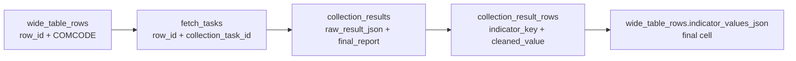

# 数据产出结果存储链路说明

日期：2026-05-14

## 结论

“采集明细”对应的持久化明细表是 `collection_result_rows`。

`db/mysql/测试数据/算法算力相关接口数据/20260313_145542` 下每一个 `result.json` 代表一次外部 Agent `GET /api/task/{task_id}/result` 返回。它不直接给验收页消费，而是先进入数据产出链路：

1. `fetch_tasks`：一行宽表对应一次 `POST /api/search` 调用。
2. `collection_results`：保存该 search 后续 `GET /api/task/{task_id}/result` 的原始 JSON 档案。
3. `collection_result_rows`：保存从原始 JSON / Markdown 表格清洗出来的逐指标明细，也就是页面“采集明细”的真实数据源。
4. `wide_table_rows.indicator_values_json`：保存最终回填到宽表 cell 的值，供“结果预览”和“验收”展示。

## 本次 Fixture 导入 SQL

导入脚本：

`db/mysql/测试数据/算法算力相关接口数据/import_algo_compute_fixture_to_trial_20260313_145542.sql`

脚本行为：

- 读取 fixture 中 19 个 `result.json` 的解析结果。
- 通过 `COMCODE` 匹配当前宽表 `WT-2026-14F916F0` 的 `wide_table_rows.dimension_values_json`，脚本兼容 `COMCODE`、`comcode`、`ComCode` 三种 JSON key。
- 当前宽表没有比亚迪 `COMCODE=299644`，脚本会自动跳过，不新增宽表行。
- 对匹配到的 18 行：
  - 创建或复用当前试运行任务组下的 18 个 `fetch_tasks`。
  - 写入 18 条 `collection_results`。
  - 写入 36 条 `collection_result_rows`，每行宽表对应 `ALGODESC`、`COMPUTEPOWERDESC` 两条采集明细。
  - 回填 18 行 `wide_table_rows.indicator_values_json` 的 `ALGODESC`、`COMPUTEPOWERDESC` cell。
  - `STATYEAR` 不生成明细、不回填，保持空值。

脚本顶部可调整变量：

```sql
SET @requirement_id = 'REQ-2026-1550C02C';
SET @wide_table_id = 'WT-2026-14F916F0';
SET @requested_task_group_id = 'TG-TRIAL-20260514183614484-01-a72f7620-snapshot-335d1b83';
```

如果当前任务组 ID 不存在，脚本会优先取该需求和宽表下最新的任务组；仍没有时才创建这个 fixture 任务组。

## 表关系



核心关联字段：

| 层级 | 表/字段 | 作用 |
| --- | --- | --- |
| 宽表行 | `wide_table_rows.wide_table_id + row_id` | 一行目标宽表数据。 |
| 维度匹配 | `wide_table_rows.dimension_values_json.COMCODE` | fixture result 与宽表行的匹配键。 |
| 搜索任务 | `fetch_tasks.row_id` | 绑定到一行 `wide_table_rows`。 |
| 外部任务 | `fetch_tasks.collection_task_id` | 保存 `POST /api/search` 返回的外部 `task_id`。 |
| 原始结果 | `collection_results.fetch_task_id` | 绑定本次 search 对应的最终 result JSON。 |
| 原始结果 | `collection_results.raw_result_json` | 保存完整 `GET /api/task/{task_id}/result` 返回 JSON。 |
| 原始报告 | `collection_results.final_report` | 保存 Agent 返回的 Markdown 表格原文。 |
| 标准行 | `collection_results.normalized_rows_json` | 保存解析后的标准指标行数组。 |
| 采集明细 | `collection_result_rows.collection_result_id` | 绑定所属原始结果档案。 |
| 采集明细 | `collection_result_rows.fetch_task_id` | 绑定所属搜索任务。 |
| 采集明细 | `collection_result_rows.wide_table_id + row_id + indicator_key` | 定位最终要回填的宽表 cell。 |
| 最终展示 | `wide_table_rows.indicator_values_json.<indicator_key>` | 结果预览和验收页读取的最终 cell。 |

## 字段映射

外部 result JSON 的 `final_report` Markdown 表格字段映射如下：

| Agent Markdown 字段 | 目标明细字段 | 目标宽表 cell 字段 |
| --- | --- | --- |
| `comcode` | `collection_result_rows.dimension_values_json.COMCODE` | 用于匹配 `wide_table_rows.dimension_values_json.COMCODE` |
| `企业名称` | `dimension_values_json.COMNAME` | 不直接回填指标 cell |
| `algodesc` | `indicator_key='ALGODESC'`, `cleaned_value`, `raw_value` | `indicator_values_json.ALGODESC.value/raw_value` |
| `computepowerdesc` | `indicator_key='COMPUTEPOWERDESC'`, `cleaned_value`, `raw_value` | `indicator_values_json.COMPUTEPOWERDESC.value/raw_value` |
| `Source_URL` | `source_url` | `source_link` 使用第一条 URL |
| `Source_Evidence` | `quote_text` | `quote_text` |
| `Min_Value` | `min_value` | `min_value` |
| `Max_Value` | `max_value` | `max_value` |

本轮不从 fixture 推导 `STATYEAR`，所以不会生成 `STATYEAR` 的 `collection_result_rows`，也不会回填 `wide_table_rows.indicator_values_json.STATYEAR`。

## 页面读取规则

“采集明细”页：

- 主数据源：`fetch_tasks.collection_rows`。
- 后端来自：`collection_result_rows`。
- 展示字段来自：
  - 指标值：`cleaned_value`
  - 原始指标值：`raw_value`
  - 单位：`unit`
  - 数据发布时间：`published_at`
  - 数据来源站点：`source_site`
  - 来源 URL：`source_url`
  - 原文摘录：`quote_text`
  - 最大值：`max_value`
  - 最小值：`min_value`
  - 指标逻辑：`reasoning`
  - 逻辑补充：`why_not_found`

“结果预览”和“验收”页：

- 主数据源：`wide_table_rows.indicator_values_json`。
- 只展示最终 cell，不直接解析 Agent 原始 JSON。
- cell 中保留 `fetch_task_id` 和 `collection_result_row_id`，用于从最终宽表值追溯回采集明细和原始结果。

## 宽表 Cell 结构

`wide_table_rows.indicator_values_json.ALGODESC` 和 `COMPUTEPOWERDESC` 的结构：

```json
{
  "value": "清洗后值",
  "raw_value": "Agent 原始表达",
  "unit": null,
  "data_source": "Agent final_report",
  "source_link": "第一条来源 URL",
  "quote_text": "证据摘录",
  "confidence": 0.86,
  "published_at": "2026-03-13",
  "max_value": null,
  "min_value": null,
  "fetch_task_id": "FT-...",
  "collection_result_row_id": "CRR-...",
  "collected_at": "2026-03-13 15:13:04"
}
```

## 校验 SQL

导入脚本末尾已经包含校验查询：

```sql
SELECT COUNT(*) AS matched_wide_rows FROM tmp_algo_compute_bind;
SELECT COUNT(*) AS imported_collection_results FROM collection_results WHERE schedule_job_id = @schedule_job_id;
SELECT COUNT(*) AS imported_collection_result_rows FROM collection_result_rows WHERE schedule_job_id = @schedule_job_id;
```

预期结果：

- `matched_wide_rows = 18`
- `imported_collection_results = 18`
- `imported_collection_result_rows = 36`
- 页面采集明细仍可显示 54 个展示行，其中 `STATYEAR` 为空，`ALGODESC` 和 `COMPUTEPOWERDESC` 有真实结果。
