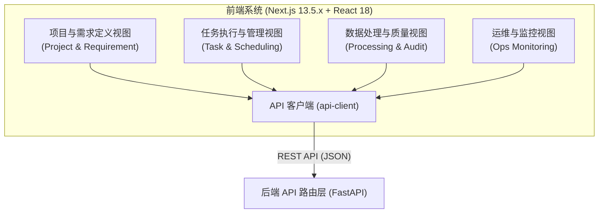
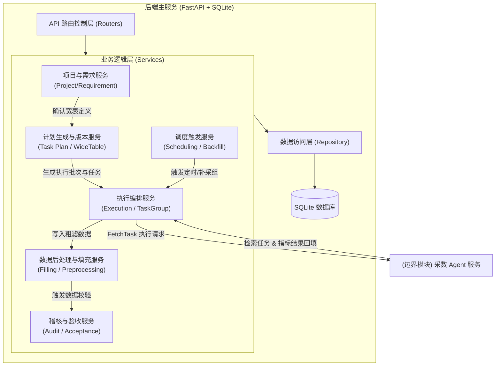
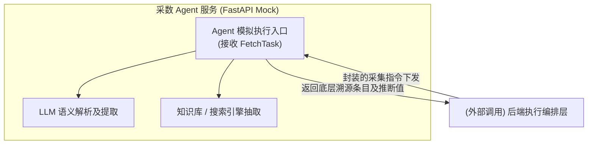
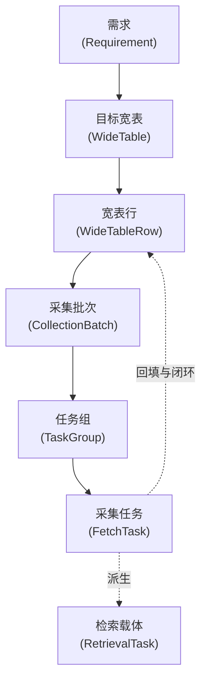

# Data Foundry系统架构与模块关系图

本文档描述了 **Data Foundry（AI采数平台）** 的完整系统架构及模块之间的详细交互关系。它反映了从需求定义、计划物化、任务执行、到结果回填和质量验证的完整技术链路。

## 系统架构图

为了更清晰地展示系统各层的内部细节及交互关系，系统架构划分为“前端架构图”与“后端及数据驱动架构图”两部分。

### 1. 前端架构图

前端主要负责与用户交互，呈现数据定义、计划观测与质量监控页面：

### 2. 后端核心架构图

后端承载了“数据生产”的核心逻辑流转，负责系统调度、计划生成以及各业务子服务的数据流控协作：

### 3. 采数 Agent 执行层架构图

Agent 层作为一个独立的服务专门承接各种爬虫/搜索及大模型（LLM）等逻辑的分发与计算：

### 3. 数据流与核心模型抽象

整个采数平台的业务流转极度依赖此数据流水线的模型跃迁，反映了从顶层的抽象需求一直下钻到最原子执行任务的拆分与闭环过程：

## 架构核心模块说明

### 1. 前端系统 (Client Layer)
前端基于 Next.js 与 React 构建，核心职责是通过 UI 提供对数据生产全生命周期的监测和配置能力：
- 页面基于 `api-client` 向后端发送请求，抛弃了纯前端的 LocalStorage Mock 方案。
- 各主要面板与后端路由层进行映射协作，呈现从项目创建到产出验收的四个阶段。

### 2. 后端主服务 (Backend Core)
基于 FastAPI 框架搭建，采用经典的三层架构，承载业务核心逻辑：
- **项目与需求服务**：控制业务容器的创建和边界定义，完成需求由 `demo` 转为 `production` 的流转并固化宽表 schema。
- **计划生成与版本服务**：数据工厂模式的**核心枢纽**。将由需求衍生的**目标宽表 (WideTable)**，结合其**覆盖模式** (如增量/快照) 与 **范围**，展开初始化为 **宽表行 (WideTableRow)**，并划分出 **采集批次 (CollectionBatch)** 即 **任务组 (TaskGroup)**。
- **执行编排服务**：实际下发和追踪最原子的 **采集任务 (FetchTask)**，进行并发控制，将 Agent 的回传结果做持久化并入库。
- **调度触发服务**：控制时间线。支持全表快照的批次下发和业务时间轴的历史重跑和定时拉起任务。
- **数据后处理与质量服务**：通过内部轻量流水线对底层传入的“粗数据”完成洗分（格式修正、空值整理、稽核阻断），构建出供前台人工介入与修订的强隔离带。

### 3. Agent 执行系统 (Agent Services)
目前为 Mock 态的单独 FastAPI 服务：
- 剥离核心计算，专注于与大模型推断或网页文本爬取的交互。
- 上行接收包含指标、来源策略在内的 `FetchTask` 执行体，并在其内部分解出子维度的 **检索任务 (Retrieval Task)** 和窄表结果，最后将打包后的采数结果返还给管控端进行回填。

### 4. 核心数据推演驱动 (Data Driven Pipeline)
整个采数平台的业务流转极度依赖此数据流水线的模型跃迁，状态机如下：
1. `Requirement` 明确范畴，绑定出一张独立的 `WideTable` 结构。
2. 系统在此基准下根据业务日期与维度范围（Scope）进行排列组合，投射出 N 条 `WideTableRow` 实体对象。
3. 系统进一步结合时间策略组织为 `CollectionBatch`（批次语义）及 `TaskGroup`（调度语义）。
4. 最原子的 `FetchTask` 被送入网络底座执行，成功后通过坐标回溯（`row_id`与`indicator_keys`），再次更新其原生起源实体 `WideTableRow`，形成完整的取数闭环。
